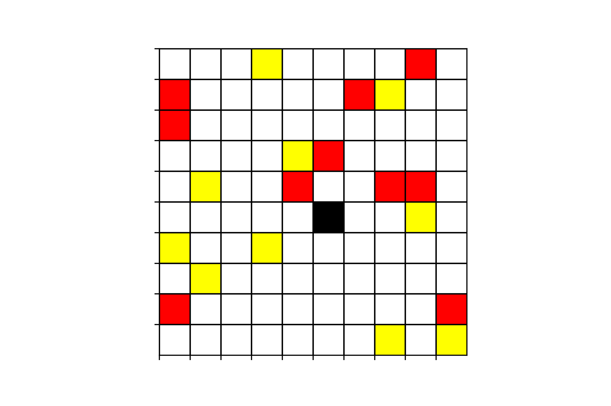
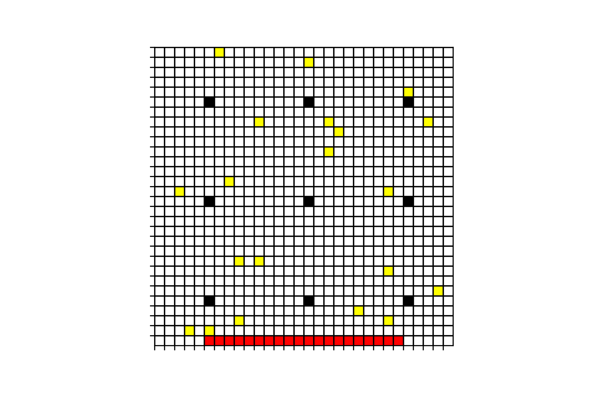
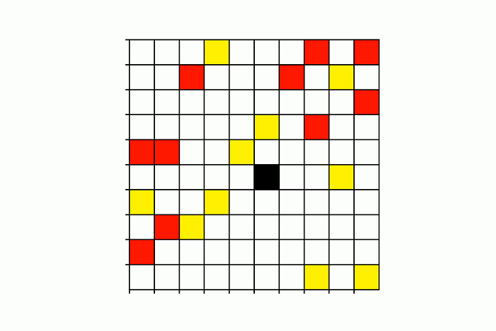

# Multi-agent ReinForcement Learning Grid World

Use the ReinForcement Learning optimization algorithm to let the machine learn to assign best targets to agents and plan the paths for agents to arrive at targets. Once the agent reaches the target, both the target and the agent disappear, and the number of targets in the environment must be equal to the number of agents. When all agents reach a certain goal, the task is completed. Our optimization goal is to complete the task in the shortest time. In addition, there are some obstacles in the environment, the agent cannot pass through the obstacles, and only one agent can exist in each grid at the same time, and the agent cannot go to the grid where other agents exist.

## Scene Description

The scene is set up as a rectangular grid field as shown below. 



The hollow grid represents no objects, the black grid represents obstacles, the red grid represents the grid where the agent is located, and the yellow grid represents the target. The number of agents and the number of targets must be the same. The agent has only 5 actions that can be performed, move up, down, left and right by one grid or stay still. When there are obstacles or other agents in the moving position, the agents cannot perform that moving. Once the agent reaches the target, both the target and the agent disappear. Our optimization is to make all agents move to some target in the shortest time.


## Requirements

- numpy
- pandas
- torch
- networkx

## Filespec

- [MAPPO](./MAPPO/): multi-agent PPO algorithm scripts in this dir
- [PPO](./PPO/): PPO algorithm scripts in this dir
- [environment.py](./environment.py/): Files stored in a simulated environment that interacts with RL. 
- [MAPPO_main.py](./MAPPO_main.py/): main program to train multi-agent PPO and test
- [PPO_main.py](./PPO_main.py/): main program to train PPO and test

## Implemented Algorithms

| **Name**         | Deep Convolution Network |
| ------------------- | ------------------ |
| multi-agent PPO with one discrete action | :heavy_check_mark: |

## Example

**MAPPO**

```python
from MAPPO.multi_agent_PPO_algorithm import multi_agent_PPO

# init MAPPO class
marl = multi_agent_PPO(
    obstacles_index=([5], [5]),
    height: 10,
    width: 10,
    agents_num: 10,
    reward_type='default',
    file_name='MAPPO.pickle',
    ortho_init=True, 
)

# training MAPPO
marl.learn(
	training_times=200,
	test_episode_times=10,
)

# test 30 * 30 size env
file_path = project_path + '/results/MAPPO.pickle'
marl.load_params(file_path=file_path)
mean_over_steps, max_over_steps = test_on_large_env(1000, marl)
```

**PPO**

```python
from PPO.PPO_algorithm import PPO_

# init PPO class
rl = PPO_(
    obstacles_index=([5], [5]),
    height: 10,
    width: 10,
    agents_num: 10,
    reward_type='default',
    file_name='PPO.pickle',
    ortho_init=True, 
)

# training PPO
rl.learn(
	training_times=200,
	test_episode_times=10,
)
```

## Method

Because each time an agent reaches the target, the number of agents is reduced by one, so we consider using multi-agent Proximal Policy Optimization (MAPPO) to learn the control scenario.

**environment**

We test two types of environment:

- 10 * 10 rectangular grid with 10 agents and one fixed position obstacle.
- 30 * 30 rectangular grid with 20 agents and 9 fixed position obstacles as follow. 



**feature engineering**

We take a multi-channel image as the state feature, and the length and width of the image are equal to the number of length and width grids of the rectangular grid. The channels are: 

- channel 1: A binary matrix, where the value 1 represents the position of the currently controlled agent.
- channel 2: A binary matrix, where the value 1 represents the position of all agents.
- channel 3: A binary matrix, where the value 1 represents the position of all targets.
- channel 4: A binary matrix, where the value 1 represents the position of all obstacles.

**reward function**

We test three types of reward:

- default reward: For each agent, it gets -1 point for each timestep forward without reaching some target. 
- reverse distance reward: On the basis of default reward, add the reciprocal of the distance to the nearest target position. 
- cooperation reward: On the basis of reverse distance reward, add the ['team spirit'](https://arxiv.org/abs/1912.06680). 

We also use a method called Dijkstra path for comparison. And in the 30 * 30 scene, the combination of Dijkstra path and MAPPO is used for planing and control. 

## Results

- In a 10 * 10 scenario, the model does not converge. But if we set the termination condition to make 9 agents reach the target and the remaining one agent does not require it to reach the target, the model can converge normally. It shows that in such a scenario, the model cannot learn to handle the situation where there is only one agent left. But changing the end condition as above will cause the last agent to perform strange operations, as shown below.



- In an environment of 30*30, 9 obstacles, and 20 agents, the algorithm does not converge. It is suspected that the reason is because the input vector is too sparse, which is equivalent to the invisible position of the agent in the convolutional neural network. A clever way is to divide the large area into small areas and use the shortest path and reinforcement learning to complete the task. 
